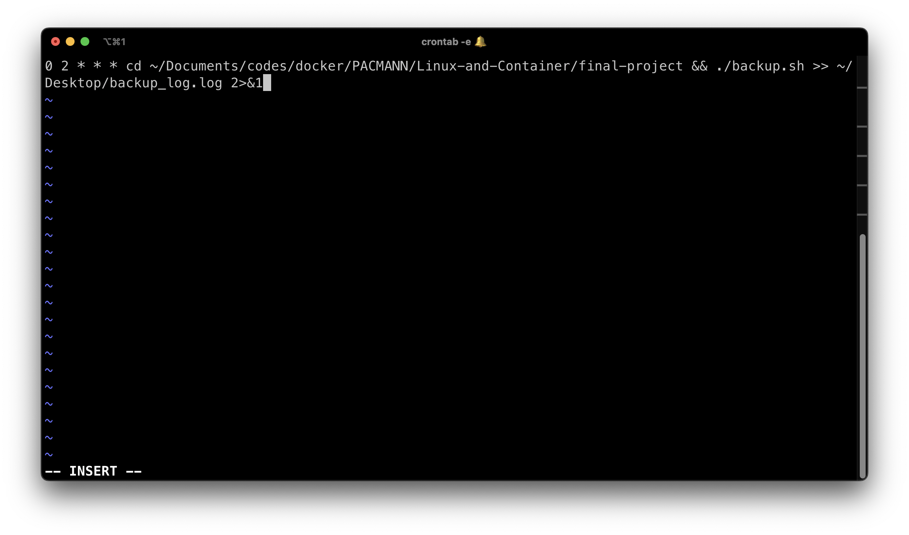

# Final Project Linux & Container

## IMPORTANT TO READ!

> This project is very dependent on [Final Project Web Development](https://github.com/syaifulhuseinnn/pacmann-final-webdev). You must clone both to your local computer and place them into same folder.

## How to Install

1. Create new folder on your computer. Let say named **final-project**

2. Clone **pacmann-final-linux-container** and **pacmann-final-webdev** using commands below. Once done, there are folders **pacmann-final-linux-container** and **pacmann-final-webdev** on your computer

```shell
git clone https://github.com/syaifulhuseinnn/pacmann-final-linux-container.git

git clone https://github.com/syaifulhuseinnn/pacmann-final-webdev.git
```

3. Copy all files and folders inside **pacmann-final-linux-container** and **pacmann-final-webdev** folders to **final-project** folder. The folder should look like below:

```
/final-project
    /todo-app-backend
       # other files here
    /todo-app-frontend
       # other files here
    /db-backup
       # other files here
    /postgres
       # other files here
    backup.sh
    compose.yaml
    README.md
    restore.sh
```

4. Now enter to folder **final-project** and start application stack using Docker. Container **final-project** will run. Validate with `docker ps` or Docker Desktop.

```shell
cd final-project
docker compose up -d
```

5. You can access applications

   - todo-app-frontend: `localhost:3001`
   - todo-app-backend: `localhost:3000`
   - database:
      - host: `localhost`
      - port: `5433`
      - user: `postgres`
      - password: `qwerty`
      - database name: `todo-app`

## Background

Salah satu tantangan sebagai calon Software & Data Engineer adalah bisa melakukan deployment project dengan baik. Pada project kali ini anda akan mendeploy sebuah aplikasi web yang anda telah buat pada Final Project Fundamental Web Development. 

Ada dua hal yang harus diselesaikan dalam project ini.
1. Deployment

    Proses deployment aplikasi ini dilakukan dengan menggunakan Docker sebagai tools utama. Anda akan membuat dua image yang diperlukan untuk menjalankan aplikasi.

    Untuk lebih jelasnya, berikut adalah fitur serta batasan project ini:
    
      1. Terdapat 2 image yang akan dibuat :
         - Image untuk aplikasi flask.  
         - Image untuk database postgresql.
      2. Image aplikasi flask bergantung pada image postgresql.
      3. Ketergantungan image flask kepada image postgresql karena pada saat dijalankan, aplikasi flask membutuhkan koneksi ke database postgresql.

2. Penjadwalan otomatis backup data

    Selain tugas deployment, Anda juga bertanggung jawab untuk mengatur penjadwalan otomatis backup data dari database PostgreSQL. 
      - Backup ini dilakukan setiap hari untuk menjaga keamanan dan keandalan data. 
      - Selain itu, Anda juga akan membuat script khusus untuk restore data dari backup tersebut, sehingga data dapat dikembalikan dengan cepat jika terjadi kegagalan atau kerusakan pada database.

Project ini memberikan kesempatan kepada Anda untuk mengaplikasikan pengetahuan dan keterampilan yang telah Anda pelajari. Anda akan memperdalam pemahaman tentang deployment aplikasi web, penggunaan Docker untuk menjalankan aplikasi dalam kontainer, manajemen database menggunakan PostgreSQL, dan juga keamanan data dengan backup dan restore.

Anda akan diminta untuk mendeploy aplikasi tersebut berdasarkan tahapan-tahapan yang telah dipelajari.

## Steps

### 1. Create Dockerfile to Build Flask App Images

Dockerfile saved in **todo-app-backend** folder

```Dockerfile
# pull base image from Dockerhub
FROM python:3.8-slim
# set application directory on container
WORKDIR /app
# copy all files and folders from current directory to application directory on container
COPY . /app
# update and install ping
RUN apt-get update && apt-get install inetutils-ping
# install dependencies for Python
RUN pip install -r requirements.txt
# run this command when container start
CMD ["flask","run","--debug","--host=0.0.0.0"]
```

### 2. Setup Postgresql Images

Dockerfile saved in postgres folder

```Dockerfile
# pull base image from Dockerhub
FROM postgres:latest
# set environments on container
ENV POSTGRES_USER=postgres
ENV POSTGRES_PASSWORD=qwerty
ENV POSTGRES_DB=todo-app
# create tables when building image
COPY init.sql /docker-entrypoint-initdb.d/
EXPOSE 5432
```

### 3. Create Docker-Compose To Create And Run Services and Volumes

`compose.yaml` saved in root directory **final-project**

```yaml
services:
  # service name
  database:
    build:
      # read Dockerfile for build image
      context: ./postgres
    # set container name
    container_name: todo-app-postgres
    # connect to network
    networks:
      - todo-app
    # mount volume between host and container
    volumes:
      - type: volume
        source: todo-app-volume
        target: /var/lib/postgresql/data
    # set when container should restart
    restart: on-failure
    # mapping port
    ports:
      - "5433:5432"
  
  # service name
  flask:
    build:
      # read Dockerfile for build image
      context: ./todo-app-backend
    # set container name
    container_name: todo-app-backend
    # connect to network
    networks:
      - todo-app
    # mount volume type bind between host and container
    volumes:
      - type: bind
        source: ./todo-app-backend
        target: /app
    # set when container should restart
    restart: on-failure
    # flask app must start after database service up
    depends_on:
      - database
    # mapping port
    ports:
      - "3000:5000"

  react:
    build:
      # read Dockerfile for build image
      context: ./todo-app-frontend
    # set container name
    container_name: todo-app-frontend
    # run this command when container start
    command: sh -c "npm rebuild esbuild && yarn dev"
    # connect to network
    networks:
      - todo-app
    # mount volume type bind between host and container
    volumes:
      - type: bind
        source: ./todo-app-frontend
        target: /app
    # set when container should restart
    restart: on-failure
    # react app must start after database and flask services up
    depends_on:
      - flask
      - database
    # mapping port
    ports:
      - "3001:5173"

# create new volume
volumes:
  todo-app-volume:

# create new network
networks:
  todo-app:

```

### 4. Create Backup Script and Setting Scheduling Backup Using Crontab

Shell script saved in root directory of **final-project**

```bash
#!/bin/bash

# Set the current date for the backup filename (optional)
DATE=$(date +'%Y-%m-%d')

# Define the paths and filenames
CONTAINER_NAME="todo-app-postgres"
BACKUP_DIR="./db-backup"
BACKUP_FILE="$BACKUP_DIR/backup_$DATE.sql"

# Access the PostgreSQL container and create a backup
/usr/local/bin/docker exec -i $CONTAINER_NAME pg_dumpall -U postgres > $BACKUP_FILE

# Check if the backup was successful
if [ $? -eq 0 ]; then
  echo "Backup completed successfully. File: $BACKUP_FILE"
else
  echo "Backup failed. Please check the error message."
fi

```



### 5. Create Restore Script

Restore script saved in root directory of **final-project**

```bash
#!/bin/bash

# Set the path to the PostgreSQL container (replace with your container name or ID)
CONTAINER_NAME="todo-app-postgres"

# Set the path to the SQL backup file on your host machine
BACKUP_FILE="./db-backup/backup_2023-09-09.sql"

# Set the name of the target database to restore to
TARGET_DATABASE="todo-app"

# Run psql command to restore the backup within the PostgreSQL container
docker exec -i $CONTAINER_NAME psql -U postgres -d $TARGET_DATABASE < $BACKUP_FILE

# Check if the restore was successful
if [ $? -eq 0 ]; then
  echo "Restore completed successfully to database $TARGET_DATABASE."
else
  echo "Restore failed. Please check the error message."
fi

```